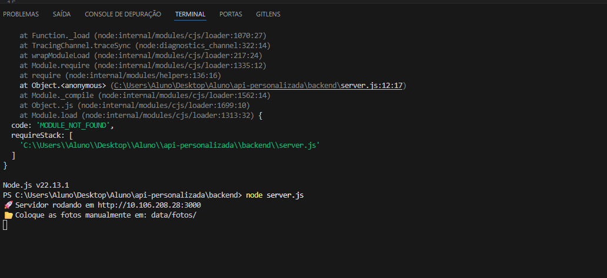
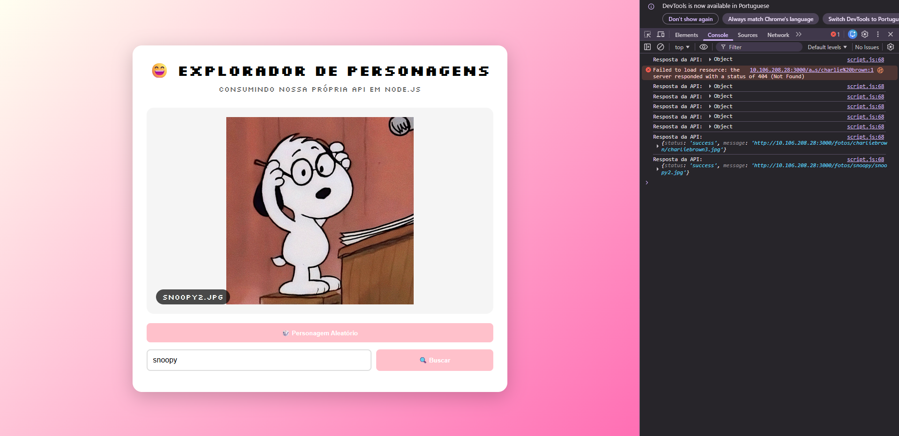
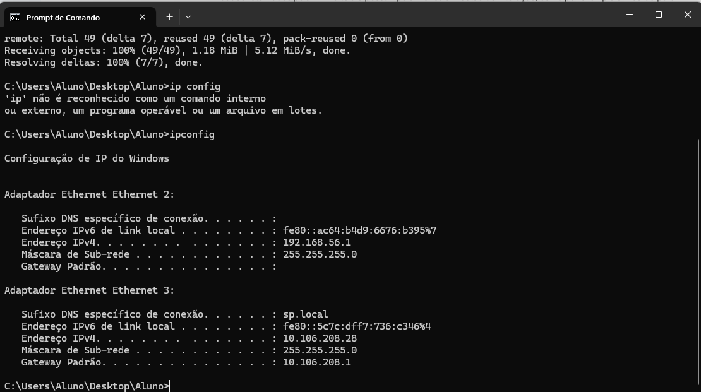
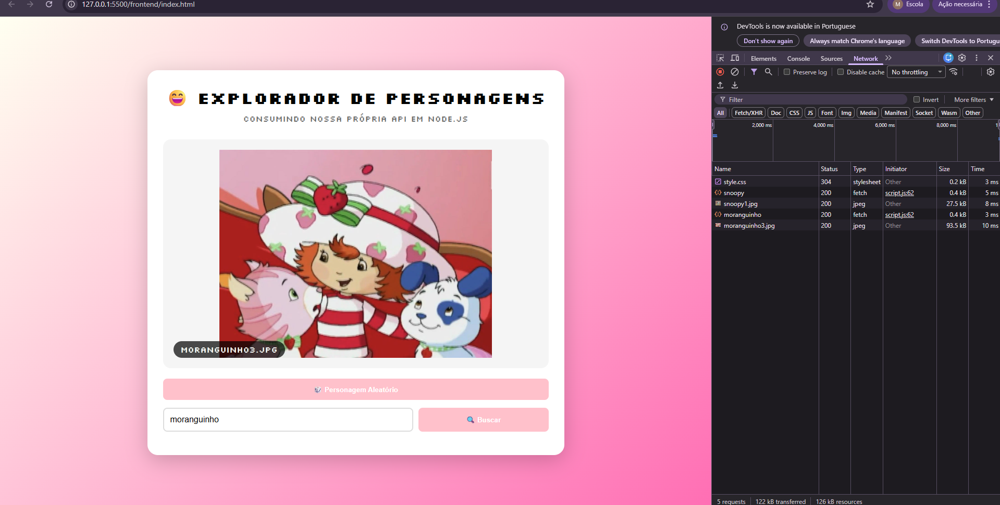

# API de Personagens

Front-End por **Mariana Ayoub** e Back-End **Raphaela Felix**. O projeto e a estética dele foi baseado em gostos que temos em comum e nossos personagens favoritos.

Uma API é um protocolo de regras e conjuntos para que dois softwares interajam entre si. O formato do arquivo para essa comunicação costuma ser em XML ou **JSON**, no nosso caso foi **JSON**

---

## Personagens disponíveis em nossa API

### Tecnologias utilizadas

---
## Processo real
API rodando: ⬇️

Front-End funcionando: ⬇️

IP da conexão Back-End: ⬇️

Network em funcionamento: ⬇️

Vídeo do funcionamento | [💟 Vídeo do funcionamento da API nas duas frentes](https://drive.google.com/file/d/1hicCtClyKOccTPqwaYlfHzYewYdmMhuo/view)

---

## Instruções e descrições

- ✌️ Endereço utilizado para testar a API: "http://localhost:3000/api/personagens/aleatorio"
- 🎯 **Instruções do Back-End:** feita com Node.js + Express, feito no "server.js". Ele coleta os dados da pasta 'fotos' e implementa na URL, além de transformar em JSON para a compreensão de outros formatos de arquivos
- 📚 **Instruções do Front-End:** faz requisição de dados da API para exibir.

---

## Veja mais projetos de Raphaela e Mariana

| Projeto               |  Online                        |
|-----------------------|-------------------------------------|
| Githib da Raphaela | [🔗 Ver online](https://github.com/raphaelafelix) | 
| Github da Mariana | [🔗 Ver online](https://github.com/Marianaaayoub) | 

---

